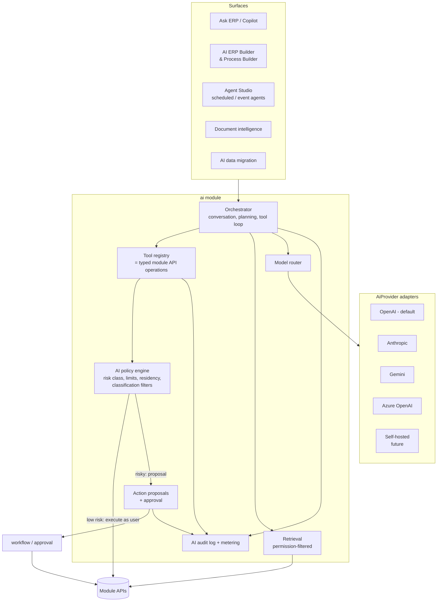

# I. AI Architecture

AI is a platform capability with the same tenant isolation, authorization, audit and residency
guarantees as every other module. It never gets a privileged path around them.

## 1. Components



## 2. Provider abstraction

Normative decisions: [ADR-0017](adr/0017-ai-platform-and-action-tiers.md). **OpenAI is the initial
default provider.** No business module imports a provider SDK. Modules call the `ai` module's
`AiPlatform` api, which routes through the `AiProvider` port. Self-hosted models are a future
adapter and are not built in the MVP.

```java
public interface AiProvider {
  ProviderCapabilities capabilities();                    // tool calling, vision, JSON schema output, context size, regions
  ChatResult chat(ChatRequest request);                   // messages, tools, response schema, limits
  Stream<ChatChunk> stream(ChatRequest request);
  EmbeddingResult embed(EmbeddingRequest request);
}
```

The **model router** chooses a provider/model per request from: tenant AI policy (allowed
providers, "external AI disabled", AI-processing region), task profile (cheap classification vs.
complex planning vs. vision extraction), data classification of the context, cost budget
(entitlement AI credits) and provider health. Domain code depends only on the orchestrator, never on
a provider SDK.

## 3. Tools = actions, under the user's identity

Pipeline for every tool call: **Authentication → Authorization → AI policy → Tool → Domain service → Audit**.

- Every tool is an **action** registered by its module through `ActionProvider`: a thin
  descriptor over an existing module API operation
  (`sales.listOverdueInvoices`, `procurement.createRequisition`, `records.query`), with JSON
  Schema for inputs/outputs, generated from the same contracts as the REST API.
- Tools execute with the **intersection** of (a) the invoking user's permissions and data
  scopes, and (b) the agent definition's allowed objects/fields/actions/monetary limits/org scope.
  An agent can never do more than the human it acts for (or, for scheduled agents, than its
  dedicated service account).
- Tool outputs pass through field-level security and classification filters **before** reaching
  the model (e.g. HEALTH fields are dropped unless policy allows AI processing of health data with
  the selected provider).
- Retrieval (RAG) uses Postgres + pgvector (tenant id + RLS on embedding rows) in the MVP;
  results are re-checked against the caller's permissions at query time, so revoked access
  takes effect immediately.

## 4. Action safety tiers and human-in-the-loop

| Tier | Class | Examples | Behaviour |
|---|---|---|---|
| 0 | read / search | search, summarize, explain, report | execute as the user; cite records |
| 1 | draft / recommend | draft email, suggest account, draft changeset | drafts or proposals only; nothing committed |
| 2 | create non-financial record | create task, lead, note, draft requisition | execute if tenant policy allows; undoable; audited |
| 3 | high-impact business action | submit PO, send invoice, change credit limit, publish config | **proposal → human approval** by a permitted user |
| 4 | financial / security / compliance | post journal, approve or send payments, refunds, payroll, tax config, permissions, deletion/export | proposal → approval by a permitted user who is **not** the requester (SoD) + optional step-up MFA → execute → audit; may be disabled per tenant; never autonomous |

Flow: **AI proposal → policy evaluation → human approval → execute (as approver-authorized
command, idempotent) → audit**. Proposals are records (`ai.action_proposal`) showing the exact
command, parameters, affected records and a deterministic preview; approvers approve the command,
not the prose.

## 5. AI ERP Builder and Process Builder

The builder's output is **manifests** (the config-as-code format), never direct writes:

1. User describes the business ("3-branch hospital, 250 beds, pharmacy, insurance billing").
2. Orchestrator recommends industry/country/language packs from the registry, then generates a
   **changeset**: org structure, entities/fields/relationships, roles/permissions, workflows,
   forms, dashboards, reports, automations — as YAML manifests constrained by JSON Schema output.
3. The changeset goes through the **same** validation, impact analysis and preview pipeline as a
   human-authored one (sandbox tenant preview with generated sample data).
4. User edits/approves; publish creates a normal ConfigRevision with author = user, co-author =
   AI interaction id.

Process Builder: "Orders above ₹5 lakh need Finance approval and above ₹20 lakh also CEO" →
workflow + approval policy manifests with CEL conditions (`order.total.amount > 500000 &&
order.total.currency == 'INR'`) rendered visually and as text before activation.

## 6. Copilot answer rules

- Answers cite the records/queries they used (links); numbers come from tool results, not the model.
- UI separates **facts** (tool results) from **analysis** (generated narrative), labelled.
- If a tool returns nothing, the answer says so — the model is instructed and evaluated never to
  fabricate records.
- Responds in the user's UI language (or the language of the question); tool calls use canonical
  identifiers so multilingual queries hit the same data.

## 7. Document intelligence & migration

Pipeline: upload → OCR/vision extraction (provider or dedicated OCR adapter) → schema-constrained
fields with confidence → validation (tax ids, totals, arithmetic) → duplicate detection (hash +
vendor/number/amount fuzzy) → matching (PO/GRN) → workflow → human review below confidence
threshold. Migration: profile source → AI proposes source→target mapping + transforms → dry run
on sample → error report → full import in batches with rollback markers → reconciliation report.
Nothing destructive without an approved dry run.

## 8. Anomaly detection

Statistical and rule-based detectors (z-score/seasonal baselines, Benford checks, duplicate
invoice rules, vendor bank-change + first-payment rules, stock usage vs. BOM) run in the analytics
layer; the LLM only **explains** and triages findings. Not everything is a prompt.

## 9. Audit, metering and evaluation

`ai.interaction` logs: tenant, user/agent, surface, prompt (with classified data masked),
provider, model, tools called with arguments, source record ids, proposal ids, approvals, result,
input/output tokens, latency, cost. Retention follows tenant policy. Usage feeds AI-credit
metering in the control plane.

An **evaluation suite** (golden conversations per surface: no-fabrication, permission leakage
attempts, prompt-injection in record text, multilingual queries, correct handling of tier 3/4 actions)
runs in CI against the configured default model and blocks promotion of prompt/model changes on
regression.
