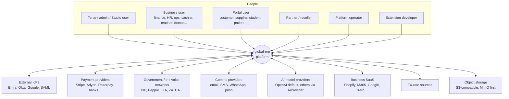
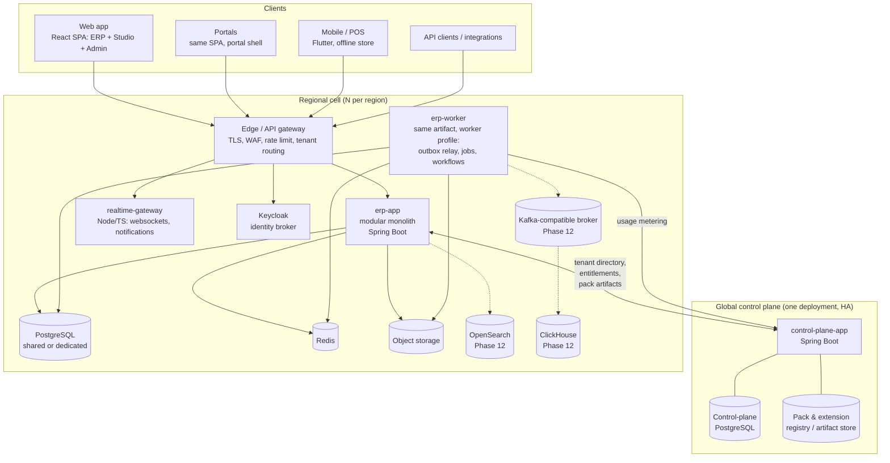
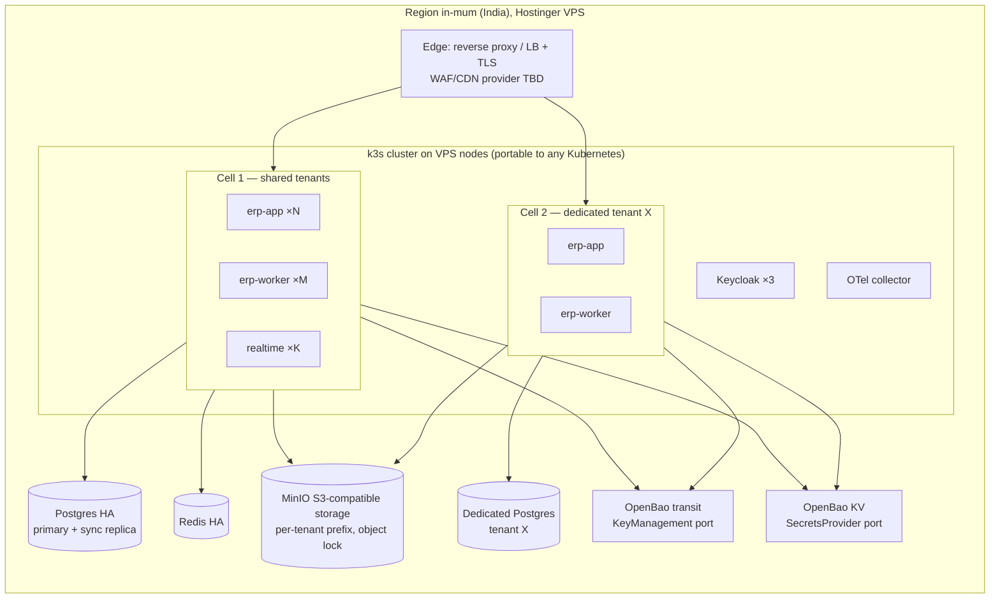
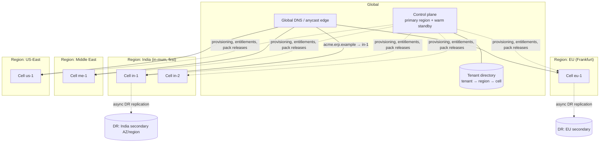

# B. Product Architecture

## 1. Guiding decisions

| Decision | Choice | ADR |
|---|---|---|
| Deployment shape | Modular monolith per **regional cell** + small **global control plane**; dependency matrix in [module-dependencies.md](module-dependencies.md) | [0001](adr/0001-modular-monolith-per-regional-cell.md) |
| Core stack | Java 21 LTS / Spring Boot / Spring Modulith, PostgreSQL, Redis | [0002](adr/0002-core-technology-stack.md) |
| Hosting | Hostinger VPS first (India, Mumbai), k3s + Terraform, cloud-portable ports | [0014](adr/0014-hosting-cloud-portability.md) |
| Naming | neutral `erp` identifiers; codename `global-erp`; branding is configuration | [0015](adr/0015-naming-and-branding.md) |
| Audit | same-transaction audit rows, asynchronous per-tenant hash-chain sealing, WORM anchors | [0016](adr/0016-tamper-evident-audit.md) |
| AI | `AiPlatform` → `AiProvider` (OpenAI default); tools are actions; safety tiers 0–4 | [0017](adr/0017-ai-platform-and-action-tiers.md) |
| Repo | Monorepo: Gradle (backend) + pnpm workspaces (frontend, SDK) | [0003](adr/0003-build-tooling-and-monorepo.md) |
| Tenant isolation | `tenant_id` on every tenant-scoped row + PostgreSQL RLS + tenant-aware routing to cells/DBs | [0004](adr/0004-tenant-isolation.md) |
| Configurability | Hybrid metadata: hardened relational engines + metadata-defined entities in a typed record store | [0005](adr/0005-metadata-storage-model.md) |
| Config format | One declarative manifest format (`apiVersion/kind/spec`) for UI, code and AI | [0006](adr/0006-configuration-as-code-manifests.md) |
| Expressions | CEL (Common Expression Language) for rules, formulas, conditions, policies | [0007](adr/0007-cel-expression-language.md) |
| Events | Transactional outbox → in-process bus (MVP) → Kafka-compatible broker (Phase 12); CloudEvents envelope with tenant, aggregate, correlation and causation | [0008](adr/0008-events-and-outbox.md) |
| Workflow | `WorkflowRuntime` port; DB-backed engine for MVP, Temporal adapter later | [0009](adr/0009-workflow-runtime-abstraction.md) |
| Identity | Keycloak as identity broker behind an `identity` port; ERP owns authorization | [0010](adr/0010-identity-provider.md) |
| Ledger | Immutable double-entry ledger enforced in DB and domain | [0011](adr/0011-immutable-ledger.md) |
| Extensions | Declarative packs; first-party code via SPI in-process; third-party code out-of-process only | [0012](adr/0012-pack-and-extension-model.md) |
| Frontend | React + TypeScript + Vite SPA, metadata-driven renderer, ICU messages, logical-CSS RTL | [0013](adr/0013-frontend-architecture.md) |

## 2. System context (C4 level 1)



## 3. Containers (C4 level 2)



**Why `erp-app` and `erp-worker` are the same artifact:** one codebase, one set of module
boundaries, two runtime profiles. Web nodes scale on request load; worker nodes scale on queue
depth. A module can be extracted into its own service later without changing its public API
because modules only talk through published interfaces and events.

## 4. Modules inside `erp-app` (C4 level 3)

Layering is strict: a module may depend only on modules in lower layers, and only on their
`api` packages. Spring Modulith + ArchUnit tests fail the build on violations.

```mermaid
flowchart TB
    subgraph L6["Experience & intelligence"]
        ai[ai]; reporting[reporting]; analytics[analytics]; portal[portal]; search[search]
    end
    subgraph L5["Industry-neutral business engines"]
        crm[crm]; sales[sales]; procurement[procurement]; inventory[inventory]
        warehouse[warehouse]; manufacturing[manufacturing]; hr[hr]; payroll[payroll]
        projects[projects]; assets[assets]; scheduling[scheduling]; pos[pos]
    end
    subgraph L4["Hardened financial engines"]
        finance[finance: GL/AR/AP/banking]; tax[tax]; einvoice[einvoicing]; payments[payments]; billing[billing]
    end
    subgraph L3["Business platform (Studio runtime)"]
        metadata[metadata]; records[records]; workflow[workflow]; rules[rules]
        automation[automation]; documents[documents]; comms[communications]
        notif[notifications]; files[files]; integrations[integrations]; packs[packs]
    end
    subgraph L2["Platform services"]
        identity[identity]; authz[authorization]; tenant[tenant]; org[organization]
        l10n[localization]; audit[audit]; compliance[compliance]; flags[features]
    end
    subgraph L1["Shared kernel (libraries, no business state)"]
        core[platform-core: ids, money, time, errors, tenant context, events]
    end
    L6 --> L5 --> L4 --> L3 --> L2 --> L1
    L6 --> L3
    L5 --> L3
```



Notes:

- `finance` sits *below* the business engines: sales, procurement, inventory, payroll and POS
  post to the ledger through the `finance` API (`PostingService`), never by writing ledger tables.
- `records` is the runtime for metadata-defined entities (see [database.md](database.md#3-metadata-defined-records)).
  Hardened engines expose their entities to the metadata layer as **system entities** so Studio
  can add custom fields, forms, views and workflows to e.g. `SalesInvoice` without owning its storage.
- `packs` installs and upgrades Country/Industry/Language packs by writing manifests into
  `metadata`, data into owning modules (tax rates → `tax`, CoA templates → `finance`) and
  registering SPI implementations.

## 5. Request lifecycle (synchronous command)

```mermaid
sequenceDiagram
    autonumber
    participant C as Client
    participant G as Gateway
    participant A as erp-app
    participant Z as authorization
    participant M as module (e.g. sales)
    participant DB as PostgreSQL
    participant O as outbox
    C->>G: POST /api/v1/sales/orders (JWT, Idempotency-Key, X-Correlation-Id)
    G->>G: TLS, WAF, rate limit, resolve tenant → cell
    G->>A: forward
    A->>A: validate JWT, build RequestContext(tenant, user, org scope, locale, tz, correlationId)
    A->>Z: authorize(action=sales.order.create, resource attrs)
    Z-->>A: PERMIT + row/field filters
    A->>M: command
    M->>DB: BEGIN; SET LOCAL app.tenant_id; insert…; idempotency record
    M->>O: append domain event (same tx)
    M->>DB: audit row (same tx); COMMIT
    A-->>C: 201 + resource (field-level security applied)
    O-->>O: relay → subscribers (workflow, automation, search, analytics)
```

## 6. Deployment architecture

### Local development

`docker compose` (in `infra/local/`) runs PostgreSQL 16+, Redis, Keycloak, MinIO, Mailpit and
optionally the observability stack (OTel collector, Prometheus, Grafana, Tempo/Loki). The backend
runs from the IDE or `./gradlew bootRun`; the frontend with `pnpm dev`. Control plane and one
cell run on the same machine; a seeded "local" region is registered automatically.

### Production (per region)

First region: `in-mum`, Hostinger KVM VPS in Mumbai ([ADR-0014](adr/0014-hosting-cloud-portability.md)).
Managed cloud services are not assumed: each component below is a self-hosted container, behind a port.



- **Cell** = a unit of deployment and blast radius: app + worker pods, a Postgres cluster, a Redis,
  and a storage prefix. Shared-SaaS tenants are packed into shared cells; a dedicated-database
  tenant gets its own Postgres attached to a shared cell's compute; a dedicated-environment tenant
  gets an entire cell (and optionally its own servers/network).
- Infrastructure is defined in **Terraform** (`infra/terraform/`): provider-specific modules
  (`providers/hostinger`, later `providers/aws`) under a provider-neutral `cell` layer. Host
  configuration uses Ansible (`infra/ansible/`); Kubernetes manifests use Helm (`infra/helm/`).
  Kubernetes (k3s) is the production target, but no code depends on it: health/readiness
  endpoints and 12-factor config keep other runtimes viable.
- Postgres HA runs on the CloudNativePG operator (primary + synchronous replica, WAL archiving to
  object storage). Off-site backup location: see roadmap open questions.
- **CI/CD:** GitHub Actions — build, test, SAST, dependency scan, image build + sign (cosign),
  deploy to dev → staging cells automatically, production cells via progressive rollout
  (canary cell first).

## 7. Multi-region architecture



Rules:

1. **Regions are data, not code.** `region` and `cell` are rows in the control plane
   (code, display name, jurisdiction, provider, endpoints, DR pair, residency tags). Adding a region
   or a provider = Terraform apply + one control-plane record.
2. **Tenant business data never leaves its home region.** The control plane stores only what it
   needs globally: tenant id, name, home region/cell, plan, entitlements, installed pack versions,
   usage aggregates, billing contact. No transactional business data, no PII beyond the billing
   contact.
3. **Routing:** tenants get a subdomain or custom domain; the edge resolves host → tenant → cell
   from a replicated, cached copy of the tenant directory. API clients may also call the
   region-specific hostname directly.
4. **Residency policy** per tenant: primary data region, backup region, AI-processing region, log
   region, export restrictions, "external AI disabled". Enforced in the cell (see
   [security.md](security.md#8-data-residency-enforcement)).
5. **DR:** each cell has a documented RPO/RTO tier. Default shared tier: PITR with continuous WAL
   archiving (RPO ≤ 5 min), cross-AZ HA (RTO ≤ 1 h for AZ loss), cross-region restore within the
   same jurisdiction (RTO ≤ 8 h). Dedicated tenants can buy a hot-standby tier.
6. **Control-plane outage must not stop cells.** Cells cache the tenant directory, entitlements
   and pack artifacts; they degrade to read-only for *provisioning/upgrade* operations only.
7. **Tenant relocation** between cells/regions is a controlled, audited workflow (logical export →
   import → verification → DNS switch), not a live cross-region query path.

## 8. Cross-cutting concerns

| Concern | Approach |
|---|---|
| Correlation | `X-Correlation-Id` accepted or generated at the edge and propagated via W3C `traceparent`, MDC, the event envelope (`correlationid`, `causationid`), workflow and job context. |
| Branding | product name, logos and tokens are configuration per platform and tenant (ADR-0015); no brand in code or contracts. |
| Observability | OpenTelemetry SDK (traces, metrics, logs) → OTel collector → Prometheus/Tempo/Loki/Grafana; Datadog via collector exporter. JSON structured logs. |
| Health | `/actuator/health/liveness`, `/readiness`, dependency health contributors (DB, Redis, IdP, storage). |
| Errors | RFC 9457 Problem Details with stable `type` URIs and translation keys (`errors.sales.order.credit_limit_exceeded`) — never localized strings from the server core. |
| Idempotency | `Idempotency-Key` header required on all financial/payment mutating endpoints; stored per tenant with request hash and response. |
| API | REST, OpenAPI 3.1 generated from code, `/api/v1/…`, cursor pagination, RFC 8288 links. Webhooks signed (HMAC + timestamp). |
| Config | Spring profiles + environment variables; secrets through the `SecretsProvider` port (OpenBao first), never in the repo. |
| Resilience | Resilience4j timeouts/circuit breakers/bulkheads on every outbound adapter; retries only for idempotent operations; DLQ tables for failed events and jobs. |
| Caching | Redis for compiled metadata, permission sets, sessions, rate limits — keys always prefixed with tenant id; in-process Caffeine L1 with pub/sub invalidation. |
| Time | All instants `timestamptz` in UTC; business dates as `date` with explicit legal-entity timezone. `Clock` injected everywhere for tests. |

## 9. Repository layout (target for Phase 1)

Java packages follow ADR-0015: `erp.platform.<lib>`, `erp.<module>.api|internal`, `erp.adapters.<name>`.

```
global-erp/  (repository: erp-global)
├─ backend/                       Gradle multi-project (Kotlin DSL), toolchain Java 21
│  ├─ build-logic/                convention plugins (java, spring-module, test, archunit)
│  ├─ platform/                   shared kernel libraries (no business state)
│  │  ├─ platform-core/           ids (UUIDv7), Money, CurrencyCode, time, errors, TenantContext, RequestContext
│  │  ├─ platform-persistence/    tenant-aware DataSource, SET LOCAL tenant, Flyway helpers, roles
│  │  ├─ platform-security/       PolicyDecisionPoint interface, @Authorize, JWT → RequestContext
│  │  ├─ platform-web/            problem details, idempotency filter, correlation, pagination, OpenAPI
│  │  ├─ platform-events/         outbox, envelope, relay, inbox (Phase 1: outbox + in-process relay)
│  │  ├─ platform-expressions/    CEL environment + sandbox limits (Phase 2)
│  │  ├─ platform-actions/        ActionProvider registry (Phase 2/4)
│  │  └─ platform-test/           Testcontainers base (erp_app role), TenantIsolationSuite, fixtures
│  ├─ modules/<context>/          one Gradle module per bounded context
│  │     └─ src/main/java/erp/<context>/{api,internal}/
│  ├─ spi/                        extension SPIs (country-pack, payment-provider, einvoice, ...)
│  ├─ adapters/                   provider adapters (storage-s3, email-smtp, ai-openai, payments-razorpay, ...)
│  └─ apps/
│     ├─ erp-app/                 regional cell application (web + worker profiles)
│     └─ control-plane-app/       global control plane
├─ contracts/                     OpenAPI snapshots, event catalog schemas, control-plane contract
├─ frontend/                      pnpm workspace (ADR-0013 for boundaries)
│  ├─ apps/{web,portal,ops-console}/
│  └─ packages/{ui,api-client,auth,i18n,metadata-runtime,workflow-ui,reporting,cel,shared,config}
├─ mobile/                        Flutter (added in the phase that needs it)
├─ packs/                         first-party packs as manifests (+ SPI code in backend/adapters)
│  ├─ country/{in,ae,us,...}/
│  ├─ industry/{education,healthcare,restaurant,...}/
│  └─ language/{en,te,hi,ar,...}/
├─ sdk/                           manifest JSON Schemas, SDK docs/spec, `erpctl` CLI
├─ infra/{local,terraform,ansible,helm}/
├─ scripts/                       dev-up, dev-check, bootstrap helpers
├─ .github/workflows/
└─ docs/
```
