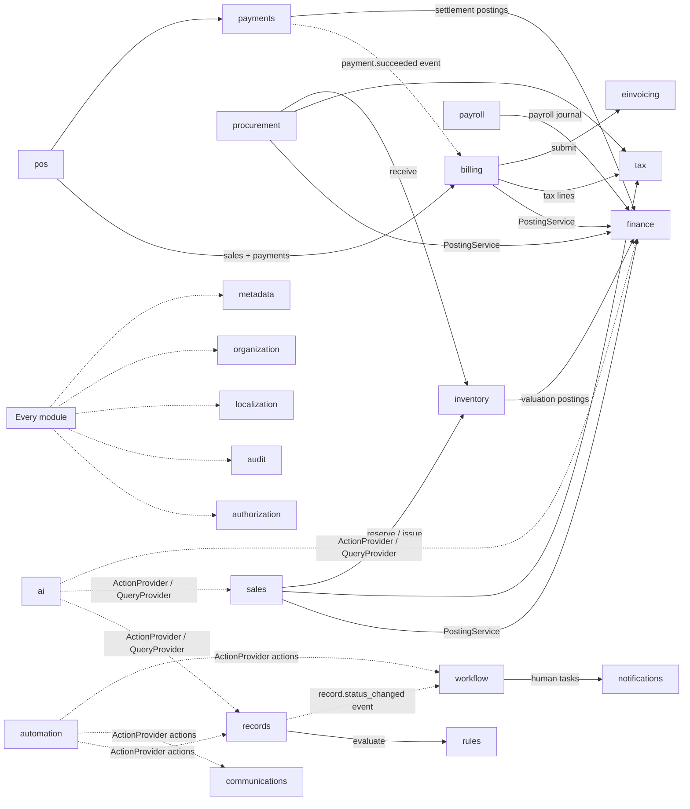
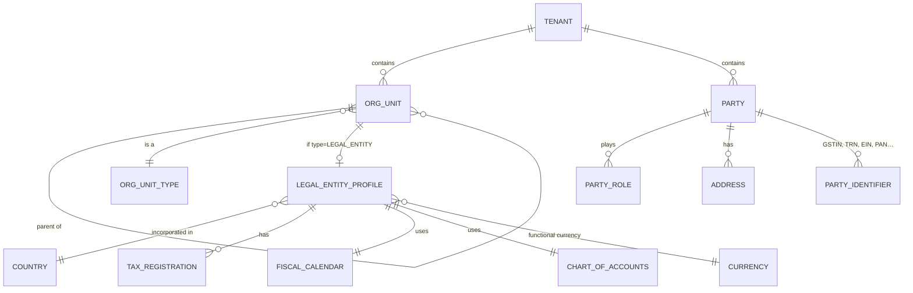

# C. Domain Boundaries

## 1. Classification of bounded contexts

Each bounded context is one Gradle module with a published `api` package. The allowed dependencies between modules are fixed in [module-dependencies.md](module-dependencies.md) (commands, queries,
DTOs, events) and a private `internal` package. **No module reads another module's tables.**
Cross-module interaction is either a synchronous call to the other module's `api` or an
asynchronous domain event.

Integrity class decides how configurable a context is allowed to be:

- **H — Hardened:** typed relational model, invariants in code and DB constraints, metadata may
  *extend* (custom fields, forms, views, workflows around it) but never redefine the core model.
- **P — Platform:** infrastructure-like services consumed by everyone.
- **C — Configurable:** thin typed core, most behaviour from metadata and packs.

| Context | Class | Owns (aggregates) | Publishes (examples) | Layer | MVP |
|---|---|---|---|---|---|
| **cp-tenants / cp-regions / cp-entitlements** (control plane) | P | Tenant registry, Subscription, Plan, Entitlement, Region, Cell, UsageRecord | `tenant.provisioned`, `entitlement.changed` | CP | ✅ |
| **tenancy** (cell) | P | local Tenant record, TenantSettings, ResidencyPolicy, EntitlementSnapshot | `tenant.suspended` | L2 | ✅ |
| **organization** | P | OrgUnit tree (Group, LegalEntity, BusinessUnit, Division, Branch, Department, CostCenter, ProfitCenter, Location, Team) | `org.legal_entity.created` | L2 | ✅ |
| **identity** | P | User, Credential link, Session, ServiceAccount, ApiKey | `user.created`, `user.deactivated` | L2 | ✅ |
| **authorization** | P | Permission, Role, RoleAssignment, Policy (ABAC), FieldPermission, SoDRule | `role.assigned`, `sod.violation.detected` | L2 | ✅ |
| **localization** | P | Locale, LanguagePack, TranslationKey, Translation, Currency, CalendarConfig | `translation.approved` | L2 | ✅ |
| **audit** | P | AuditEvent (hash-chained) | — | L2 | ✅ |
| **compliance** | P | DataClassification, RetentionPolicy, LegalHold, ConsentRecord, DSR | `dsr.completed` | L2 | partial |
| **features** | P | FeatureFlag, FlagRule | — | L2 | ✅ |
| **party** | P | Party (person/organization), PartyRole, Address, ContactPoint, PartyIdentifier (type from Country Pack) | `party.created`, `party.merged` | L3 | ✅ (Phase 6) |
| **metadata** | P | EntityDef, FieldDef, RelationshipDef, FormDef, ViewDef, PageDef, ConfigPackage, ConfigRevision | `config.published` | L3 | ✅ |
| **records** | C | Record, RecordLink (runtime of metadata entities) | `record.created/updated/deleted`, `<entity>.status_changed` | L3 | ✅ |
| **workflow** | P | WorkflowDef, WorkflowInstance, HumanTask, Timer; Approval | `workflow.completed`, `approval.decided` | L3 | ✅ |
| **rules** | P | RuleSet, Rule (CEL) | — | L3 | ✅ |
| **automation** | P | AutomationDef, AutomationRun | `automation.failed` | L3 | ✅ |
| **documents** | P | DocumentTemplate, RenderedDocument, NumberSequence | `document.generated` | L3 | ✅ |
| **communications** | P | MessageTemplate, Message, DeliveryStatus, ChannelPreference | `message.delivered/bounced` | L3 | email only |
| **notifications** | P | Notification, Subscription, Digest | — | L3 | ✅ |
| **files** | P | FileObject, FileVersion, Attachment | `file.scanned` | L3 | ✅ |
| **integrations** | P | Connector, Connection, WebhookSubscription, WebhookDelivery, ApiClient | `webhook.failed` | L3 | ✅ webhooks |
| **packs** | P | InstalledPack, PackInstallation, PackMigration | `pack.installed/upgraded` | L3 | ✅ |
| **finance** | **H** | Account (CoA), FiscalYear, Period, Journal, JournalEntry, Party balances, BankAccount, BankStatement, ExchangeRate | `journal.posted`, `period.closed` | L4 | GL + AR/AP basics |
| **tax** | **H** | TaxJurisdiction, TaxRegistration, TaxType, TaxCode, TaxRate (effective-dated), TaxDetermination record | — | L4 | ✅ |
| **einvoicing** | **H** | EInvoiceSubmission, Certificate ref, NetworkResponse | `einvoice.accepted/rejected` | L4 | framework |
| **payments** | **H** | PaymentIntent, PaymentAttempt, Refund, Dispute, Mandate, Payout, Settlement, ProviderAccount, WebhookInbox | `payment.succeeded`, `refund.completed` | L4 | ✅ abstraction + 1–2 adapters |
| **billing** | **H** | Invoice (AR document), CreditNote, Subscription (customer-facing), BillingSchedule | `invoice.issued`, `invoice.posted` | L4 | ✅ |
| **inventory** | **H** | Item, UoM, Warehouse, Location, Lot/Serial, StockMove (ledger), StockQuant (projection), Reservation, ValuationLayer | `stock.moved`, `inventory.low` | L5 | ✅ foundation |
| **crm** | C | Lead, Contact, Account, Opportunity, Pipeline, Activity | `opportunity.won` | L5 | Phase 6 |
| **sales** | H/C | Quotation, SalesOrder, PriceList, Promotion | `order.confirmed` | L5 | Phase 6 |
| **procurement** | H/C | Requisition, RFQ, PurchaseOrder, GoodsReceipt, VendorBill match | `po.approved` | L5 | Phase 6 |
| **warehouse**, **manufacturing**, **hr**, **payroll**, **projects**, **assets**, **pos** | H/C | see prompt §28–36 | | L5 | later |
| **scheduling** | P | Resource, Capacity, Availability, Booking, Calendar | `booking.created` | L5 | Phase 9 (needed by all 3 demo packs) |
| **reporting** | P | ReportDef, DashboardDef, ScheduledReport | — | L6 | ✅ basic |
| **ai** | P | AiProviderConfig, AgentDef, AiInteraction, ActionProposal | `ai.proposal.created` | L6 | ✅ prototype |
| **marketplace** (control plane) | P | Package, PackageVersion, Publisher, Signature | — | CP | ✅ registry |
| **search**, **analytics** | P | projections only | — | L6 | Phase 12 |

**Ownership:** at this stage one team owns everything; the table above is the unit of future
team ownership and of service extraction. A context is extracted only when a concrete driver
exists (independent scale, security boundary, availability, team autonomy) — see ADR-0001.

## 2. Context map (key relationships)



Solid arrows are synchronous `api` calls; dotted arrows are events or SPI inversions. The full,
enforced matrix is in [module-dependencies.md](module-dependencies.md).

Integration patterns:

- **Posting is synchronous and transactional** where the business document and ledger must
  agree (invoice posting creates its journal entry in the same database transaction via
  `finance.api.PostingService`). Because it is one monolith and one database per tenant, this is
  a local transaction, not a distributed one. If `finance` is ever extracted, posting becomes an
  outbox-driven, idempotent command with a "pending posting" state — the API already models that
  state so callers don't change.
- **Everything else is event-driven** via the outbox (workflow triggers, automations,
  notifications, search indexing, analytics, webhooks).

## 3. Core organization and party model



- **OrgUnit** is a single typed tree (closure table for fast subtree queries) rather than one
  table per level. `ORG_UNIT_TYPE` is configurable per tenant (seeded with Group, LegalEntity,
  BusinessUnit, Division, Branch, Department, CostCenter, ProfitCenter, Location, Team) with
  allowed-parent rules, so a franchise, a hospital network or a school trust can model its own
  hierarchy. Cost/profit centers are also **accounting dimensions**, not only tree nodes.
- **LegalEntity** is the fiscal boundary: country, functional currency, fiscal calendar, CoA,
  tax registrations, number sequences, bank accounts, statutory settings. Every financial
  document belongs to exactly one legal entity.
- **Party** (person or organization) with **roles** (customer, supplier, employee, student,
  patient, guest, member…) avoids duplicating contact/address/identifier handling in every
  vertical. Industry packs add roles and role-specific fields through metadata — a *Student* is a
  Party with the `student` role plus a metadata entity for academic data.

## 4. Where industry concepts live (examples)

| Industry concept | Built from (no kernel change) |
|---|---|
| Student, Guardian | Party + role + metadata entity `edu.student` |
| Course, Batch, Exam | metadata entities |
| Timetable, Appointment, Table reservation, Room booking | `scheduling` engine (Resource/Booking) + metadata |
| Fee collection | `billing` invoices from a billing schedule + `payments` |
| Patient encounter (OPD/IPD) | metadata entity + workflow; beds = scheduling resources |
| Prescription | metadata entity + document template |
| Menu item, Recipe | inventory Item + BOM (manufacturing-lite "kit") + translations |
| Kitchen order ticket | POS order line events + metadata view (kitchen display) |
| Hotel folio | billing invoice with scheduled charges |

If a pack cannot express something with these primitives, the answer is a **new generic
capability** in the kernel (usable by all industries) or a **sandboxed extension** — never an
industry-named table or branch in core code.

## 5. Ownership and scope model

Tenancy and organization are different axes:

- **Tenancy** is the isolation boundary (RLS, [multitenancy.md](multitenancy.md#4a-tenancy-scope-of-every-table)).
- **Organizational scope** decides, *inside* a tenant, who may see or act on a record, and which
  fiscal rules apply.

Columns are therefore **not** stamped uniformly. Each aggregate declares one **ownership scope**,
and only that scope's columns are mandatory.

### Hierarchy

```
Tenant                                  (isolation boundary; not an org unit)
└─ Organization Group      org_unit type GROUP         (0..n, optional; groups legal entities for consolidation)
   └─ Legal Entity         org_unit type LEGAL_ENTITY  (fiscal boundary: country, functional currency, CoA, tax registrations)
      └─ Business Unit     org_unit type BUSINESS_UNIT
         └─ Division       org_unit type DIVISION
            └─ Branch      org_unit type BRANCH        (physical or operating site)
               └─ Department  org_unit type DEPARTMENT
Cost Center / Profit Center   org_unit types COST_CENTER / PROFIT_CENTER **and** accounting dimensions
```

- One typed tree `organization.org_unit` with a closure table. Types and allowed-parent rules
  are configurable per tenant; levels may be skipped (a small shop is Tenant → Legal Entity → Branch).
- Every org unit at or below a legal entity has a denormalized, immutable `legal_entity_id` (its
  nearest LEGAL_ENTITY ancestor). Moving a unit to another legal entity is a controlled re-org
  operation, never an in-place edit, because fiscal history depends on it.
- **Cost and profit centers** are primarily *accounting dimensions* on journal lines and documents.
  They appear in the tree only for reporting roll-ups and responsibility. They can cut across
  branches, so they are **never** used as a record's ownership scope.

### Ownership scopes

| Scope | Mandatory columns | Used for | Examples |
|---|---|---|---|
| `PLATFORM` | none (GLOBAL table) | reference data | currencies, countries, locale data |
| `TENANT` | `tenant_id` | tenant-wide configuration and shared master data | roles, metadata definitions, items, parties, price lists |
| `LEGAL_ENTITY` | `tenant_id`, `legal_entity_id` | anything with fiscal or statutory meaning | journal entries, invoices, bills, payments, tax registrations, fiscal periods, bank accounts, number sequences for statutory documents, payroll runs |
| `ORG_UNIT` | `tenant_id`, `legal_entity_id` (derived), `org_unit_id` | operational records owned by a site or team | stock locations/warehouses (branch), POS sessions, timetables, beds |
| `USER` | `tenant_id`, `owner_user_id` | personal artifacts | saved views, drafts, notification preferences, AI conversations |

Rules:

1. An aggregate's scope is declared in its module (hardened) or its `EntityDefinition`
   (`spec.ownershipScope`, metadata). Declaring a scope makes its columns `NOT NULL`. Other org
   columns are **optional attributes**, not ownership.
2. Financial documents are always `LEGAL_ENTITY` scoped. A document never spans two legal
   entities; intercompany is two documents linked by an intercompany reference.
3. Branch, department and other attributes on a financial document (for example `branch_id` on
   an invoice) are **dimensions**, used for reporting and authorization filters, not ownership.
4. Master data (items, parties) is `TENANT` scoped and optionally *restricted* to legal entities
   or org units via an assignment table (`party_legal_entity`, `item_org_unit`), not via a column.
5. Authorization data scopes (`LEGAL_ENTITY [ids]`, `ORG_SUBTREE [node]`, `OWN`) compile to
   predicates on whichever scope columns and dimensions the aggregate declares. The PDP knows each
   aggregate's scope from the compiled metadata, so a scope that does not apply to an aggregate is
   rejected at role-assignment time, not silently ignored.
6. `records.record` carries `legal_entity_id`, `org_unit_id` and `owner_user_id` as **nullable**
   columns. The entity's declared scope decides which are required.
