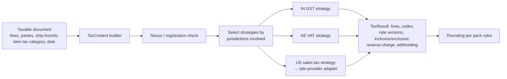

# F. Extension Architecture

Covers Country Packs, Industry Packs, Language Packs, payment adapters, integration connectors,
extensions and the config-as-code format they all share.

## 1. One packaging model: the Pack Manifest

Everything installable is a **Package** described by a manifest. The JSON Schema
`sdk/schemas/package.schema.json` is normative. The SDK documentation (`sdk/docs/`) is a published,
versioned specification, independent of the platform's own licensing.

```yaml
apiVersion: erp/v1
kind: Package
metadata:
  packId: official.country.in        # <publisher>.<type-ish>.<name>; globally unique
  type: CountryPack                  # CountryPack | IndustryPack | LanguagePack | Connector | PaymentProvider |
                                     # WorkflowTemplate | ReportPack | DashboardPack | DocumentTemplatePack |
                                     # AiAgent | Extension | UiComponent
  name: { key: pack.country.in.name, default: "India" }   # translatable
  publisher: { id: official, verified: true }
  version: 1.4.0                     # semver
spec:
  platform:
    minimumPlatformVersion: "1.2.0"
    maximumPlatformVersion: "<2.0.0" # optional
  dependencies:
    - { packId: official.language.en, version: ">=1.0 <2.0" }
  capabilities:
    provides: [tax.determination.gst, identifier.gstin, identifier.pan, payment-method.upi, address-format.in]
    requires: [finance.ledger, tax.engine]                        # kernel capabilities, not other countries
  supportedCountries: [IN]           # CountryPack: exactly one; IndustryPack: omitted (= all)
  supportedLocales: [en-IN, hi-IN, te-IN]
  permissions:                       # what the package asks for; shown to the admin at install
    - metadata.write
    - tax.rates.write
  contents:                          # manifests (same format Studio writes) and data files
    - manifests/**/*.yaml
    - data/**/*.csv
  code:                              # optional; see trust tiers in §2
    - { spi: tax.TaxDeterminationStrategy, impl: erp.packs.in.gst.GstDetermination, tier: TRUSTED_CORE }
  migrations:                        # declarative, interpreted by the platform; no arbitrary code
    - { from: "1.3.x", steps: migrations/1.3-to-1.4.yaml }
  license:
    spdx: LicenseRef-Proprietary     # or an SPDX id (MIT, Apache-2.0, ...) for open packs
    pricing: included                # included | free | paid | private
    visibility: official             # official | partner | third-party | private-tenant
  validationStatus: INTERNALLY_TESTED   # DRAFT | INTERNALLY_TESTED | EXTERNALLY_VALIDATED (country packs)
integrity:
  contentDigest: sha256:...          # over the canonical archive
  signature: ...                     # Sigstore/cosign-style, verified against the publisher's key
```

The registry (control plane `cp-marketplace`) stores versions, signatures, compatibility and
dependency graphs. The cell's `packs` module installs packages per tenant.

## 1a. Pack lifecycle

Each lifecycle operation is a durable, idempotent, audited job in the `packs` module, recorded as a
`PackInstallation` with per-step progress.

| Operation | What happens | Guarantees |
|---|---|---|
| **Install** | verify signature and digest → resolve dependencies and platform range → show requested permissions (tenant-owner approval for high-risk ones) → dry-run validation → apply contents through each owning module's `PackContentHandler` in dependency order → publish one `ConfigRevision` → record the installation | all-or-nothing per step; a failed install leaves the tenant on its previous revision |
| **Upgrade** | same checks → compute a 3-way merge (old pack, new pack, tenant overlays) → surface conflicts → run declarative migrations → publish a new revision | never rewrites historical transactions; effective-dated rules get new versions |
| **Disable** | deactivate the pack's contributions (menus, actions, automations, SPI strategies stop being selected for new work) | data and history untouched; reversible by **Enable** |
| **Uninstall** | only if no dependent packs and no referencing configuration remain; removes definitions and configuration | tenant business data created under the pack is **retained** (hidden or archived), never deleted; legal/financial records are untouchable |
| **Rollback** | re-publish the previous pack version's configuration as a new revision; reverse declarative migrations that declare a reverse step | data created under the newer version is preserved; if a migration is irreversible, rollback is blocked and says why |

Installation **never executes arbitrary code**:
- Contents are data and manifests, applied by platform code.
- Migrations are declarative steps (`addField`, `mapValues`, `copyField`, `backfillDefault`, and similar).
- SPI code exists only for `TRUSTED_CORE` packs, and it ships with the platform release, not with the package.

## 2. Trust tiers and extension security

| Tier | Examples | Runs where | Who may ship it |
|---|---|---|---|
| **Declarative** (manifests + data) | entities, fields, forms, workflows, rules, reports, templates, tax rates, CoA templates, translations | interpreted by the kernel | anyone (validated; sandboxed by construction) |
| **Trusted core extension** (in-process SPI) | GST determination, e-invoice payload builders, payroll calculators, payment adapters | inside `erp-app` (ServiceLoader, loaded at boot from the platform release) | **first-party only**: reviewed, same release train |
| **Third-party extension** (out of process) | custom logic, custom connectors, custom widgets | remote HTTPS endpoint (webhook-style contract), later possibly WASM; UI in sandboxed iframes | third parties, partners, tenants |

**Every extension, of every tier, is prevented from:**

| Must not | How it is prevented |
|---|---|
| query another tenant | third-party: tokens are bound to one tenant and installation, and every API call runs under RLS. Trusted core: SPI methods receive a tenant-scoped input DTO and have no DB handle. |
| modify arbitrary tables | no extension receives a repository or DB connection. Pack content goes through `PackContentHandler`, and runtime effects only through actions and public APIs. |
| bypass permissions | third-party calls use a service-account token limited to the permissions the tenant granted at install (consent screen). Trusted core SPIs are invoked *by* modules after authorization, and return results, not side effects. |
| bypass audit | all effects go through module APIs and actions that write audit. Extensions cannot write `audit` directly. |
| bypass ledger rules | the only path to the ledger is `PostingService`, which validates everything. Extensions never post directly; SPIs such as tax strategies return computations that the owning module posts. |
| access unrestricted secrets | secrets are resolved by the platform per installation (connector credentials scoped to that tenant and installation). Trusted core code receives only the secret references its SPI declares. Third-party code never sees platform secrets. |
| run unbounded | remote calls have timeouts, circuit breakers, per-tenant rate limits and payload size limits; iframe UIs use CSP and `sandbox` attributes and talk to the host through a postMessage bridge with an allow-listed API. |

Architecture tests enforce the trusted-core constraints: SPI implementation packages may not
depend on `..internal..`, `platform-persistence`, JDBC or HTTP clients (except adapters that need
HTTP, which get a pre-configured, audited client). Third-party extensions run under a separate
**marketplace review** (Phase 11) and can be disabled platform-wide by a kill switch.

## 3. Country Packs

A Country Pack packages everything jurisdiction-specific. The kernel exposes **extension
points** and never branches on country codes; code review and an ArchUnit/grep rule reject
ISO country literals outside `packs/` and `adapters/`.

| Area | Declarative content | SPI extension point (first-party code) |
|---|---|---|
| Identifiers | identifier types (GSTIN, PAN, TRN, EIN…), regex, label keys | `IdentifierValidator` (checksums) |
| Addresses / phones | address format templates, required parts, postal-code patterns | — (uses libaddressinput / libphonenumber data) |
| Tax | jurisdictions, tax types, codes, categories, **effective-dated** rates, exemption reasons, reverse-charge rules, withholding sections | `TaxDeterminationStrategy`, `TaxReportBuilder` |
| Accounting | CoA templates, default posting profiles, fiscal-year defaults, rounding rules | `StatutoryReportProvider` |
| Documents | invoice mandatory fields, numbering rules, templates, legal texts (translatable) | `DocumentValidator` |
| E-invoicing | network config | `EInvoiceAdapter` (transform → validate → sign → submit → parse response) |
| Payroll | components, slabs, contribution rules (effective-dated) | `PayrollRuleSet` |
| Banking / payments | payment methods available, bank file formats | `BankFileFormat`, payment-method catalog |
| Privacy / retention | default retention periods, consent requirements | — |

**Scope of application:** a Country Pack applies to legal entities incorporated in (or registered
for tax in) its country. A tenant with Indian and UAE legal entities installs `country.in` and
`country.ae`. Strategies are selected per legal entity and transaction (ship-from/ship-to,
registrations), never per tenant.

**Effective dating and history:** every rule artifact has `effectiveFrom`, `effectiveTo`,
`version`, `jurisdiction` and `approvalStatus` (for example *India GST rate rule v4, effective
2026-04-01 → open*). Selection uses the transaction's tax point date, not the install date. Rates/rules are immutable once approved; a change
is a new version. Transactions store the **rule version ids and computed results** they used
(e.g. tax lines with `tax_rate_version_id`), so re-rendering a 2024 invoice in 2027 reproduces
2024 tax exactly. Pack upgrades never rewrite historical rows.

**Legal disclaimer:** pack metadata carries a `validationStatus` (`DRAFT | INTERNALLY_TESTED |
EXTERNALLY_VALIDATED`). The product must not describe a pack as compliant/certified unless it is
`EXTERNALLY_VALIDATED` with a recorded reviewer.

**India is the first go-to-market country.** The **IN** pack is built first and deepest:
- GST (CGST/SGST/IGST/UTGST, cess);
- GSTIN, PAN and TAN validators;
- HSN/SAC;
- TDS/TCS;
- e-invoice IRP and e-way bill adapters;
- UPI and NetBanking payment methods;
- Indian address format;
- the GST-compliant invoice template.

All of it lives in `packs/country/in` and first-party adapters, never in generic modules. The
kernel source rule rejects GST, GSTIN, PAN, TDS, UPI and similar identifiers outside packs and
adapters.

Next, **AE** (VAT, TRN, invoice requirements) and **US** (sales tax with state/county/city
jurisdictions via a pluggable rate provider, EIN, ACH) prove that the model generalizes. There are
framework stubs for GB, SG, AU, CA, DE, FR, SA, JP and BR.

## 4. Tax engine seam



The kernel owns the data model (jurisdiction, registration, code, rate, determination record)
and the pipeline; strategies own the country logic. No single formula serves all countries.

## 5. Industry Packs

Industry packs are **declarative only** by default: entity/field/relationship definitions,
forms, pages, views, workflows, approval policies, rules, automations, roles & permission sets,
dashboards, reports, document templates, number sequences, scheduling resource types, AI agent
instructions, sample (demo-only) data. They reference kernel capabilities (billing, scheduling,
inventory, POS) through **system entities and actions**, not code.

Composition (§101): a tenant installs, for example, `industry.restaurant` + `country.in` +
`language.te` + `payments.razorpay`, or the **same** `industry.restaurant` + `country.ae` +
`language.ar` + `payments.adyen`. There are never per-country industry apps (`restaurant-india`).
Industry packs declare `capabilities.requires` (for example `tax.category-mapping`,
`payment-method.any`) and never depend on a specific country pack. Packs must be written against **abstract capabilities**:
the restaurant pack says "menu items use tax category `FOOD_SERVICE`"; each country pack maps
tax categories to its tax codes. The pack validator fails a pack that references
country-specific codes.

Pack upgrade with tenant customizations: tenant changes are stored as **overlays** on pack
components (like a three-way merge base: pack v1 → tenant overlay; pack v2 is merged; conflicts
surface in Studio for resolution). Tenants never edit pack-owned rows in place.

## 6. Language Packs

Language pack = translation bundle(s) for keys in namespaces (`core.*`, `finance.*`,
`pack.edu.*`) + locale data overrides + optional fonts reference. Each translation has
`status: MACHINE | HUMAN_VERIFIED | LEGAL_VERIFIED`, `version`, author. Importing never
overwrites a `HUMAN_VERIFIED`/`LEGAL_VERIFIED` string with a lower-status one; conflicts go to a
review queue. See [localization.md](localization.md).

## 7. Configuration as code and promotion

All configuration — whether created in Studio, written in YAML, or proposed by AI — is the same
set of manifests:

```yaml
apiVersion: erp/v1
kind: EntityDefinition
metadata: { name: edu.student, labelKey: pack.edu.entity.student }
spec:
  partyRole: student
  fields:
    - { name: admissionNumber, type: sequence, sequence: edu.admission, unique: true }
    - { name: dateOfBirth, type: date, required: true, classification: PII }
    - { name: grade, type: lookup, target: edu.grade, indexed: true }
    - name: age
      type: integer
      formula: "age(record.dateOfBirth, today())"
```

Lifecycle: **draft changeset → schema validation → semantic validation → impact analysis →
approval (policy-driven) → publish as immutable ConfigRevision → compile → activate**. Every
revision has author, diff, approver and can be rolled back (rollback = publish of the previous
content as a new revision; data created under newer fields is preserved, fields are hidden, not
dropped). `erpctl` CLI can `pull`, `diff`, `validate`, `push` the same manifests from Git.

Impact analysis checks: removed/renamed fields referenced by workflows, rules, formulas,
reports, templates, integrations; circular formulas; relationship cardinality changes vs
existing data; permission exposure changes (a field becoming visible to a broader role);
classification downgrades; pack dependency breakage; count of active records affected.

## 8. Payment provider adapters

```java
public interface PaymentProvider {
  ProviderDescriptor descriptor();                         // id, supported countries/currencies/methods, capabilities
  AuthorizeResult authorize(AuthorizeRequest r);           // may return REQUIRES_ACTION (3DS, UPI collect, redirect)
  CaptureResult capture(CaptureRequest r);
  VoidResult voidAuthorization(VoidRequest r);
  RefundResult refund(RefundRequest r);
  WebhookParseResult parseWebhook(WebhookRequest raw);     // verifies signature, maps to canonical events
  Optional<MandateResult> createMandate(MandateRequest r); // capability-gated
  SettlementReport fetchSettlement(SettlementQuery q);     // for reconciliation
}
```

- Canonical `PaymentIntent` state machine lives in the `payments` module; adapters only translate.
- Routing (`PaymentRouter`) picks provider account by rules over country, currency, method,
  amount, merchant account, health (circuit breaker state), configured fees/success rates. It
  **never** auto-fails-over a card attempt to another provider after a decline — only on
  pre-submission errors / outages, per provider rules.
- Card data never touches our servers: hosted fields / provider SDK tokens only (SAQ-A target).
- Contract tests: every adapter must pass the shared `PaymentProviderContractTest` against the
  provider's sandbox or recorded fixtures (duplicate webhooks, out-of-order events, partial
  refunds, currency mismatch).

Same pattern for `EInvoiceAdapter`, `MessageChannelProvider` (email/SMS/WhatsApp/push),
`StorageProvider` (S3-compatible: MinIO first), `AiProvider` (ADR-0017), `FxRateSource` and
`BankFeedProvider`.

## 9. Integration connectors and API

- Public REST API with OpenAPI; OAuth2 client credentials + API keys with scopes; per-client
  rate limits; `Idempotency-Key`; cursor pagination.
- **Webhooks:** tenant subscribes to event types (`invoice.posted`, `payment.received`, …);
  deliveries are signed, retried with exponential backoff, recorded, and replayable.
- **Connector framework:** a connector declares auth type, configuration schema, triggers
  (events it reacts to) and actions (operations it exposes to automations/AI). First-party
  connectors are adapters in `backend/adapters`; third-party connectors are out-of-process.
- **Extension events** use stable, versioned names from the published event catalog
  (`customer.created`, `invoice.posted`, `order.confirmed`, `inventory.low`, `appointment.booked`…).
  Payloads are CloudEvents with a JSON Schema per version.
