# K. Module Dependencies and Integration Contracts

This document is normative. `ModuleDependencyRules` (ArchUnit + Spring Modulith `ApplicationModules.verify()`)
encodes the matrix below. A dependency that is not listed here fails the build.

## 1. Rules

1. A module exposes exactly one public package, `erp.<module>.api`: command/query interfaces,
   DTOs (records), event payload types and error codes. Everything else lives in `erp.<module>.internal`.
2. **Synchronous** dependencies are compile-time calls to another module's `api` interfaces. They
   are allowed only **downward**, or **sideways within a layer when listed below**. The graph must be
   acyclic: Spring Modulith cycle detection runs in `check`.
3. **Asynchronous** dependencies are subscriptions to another module's published events (outbox,
   [ADR-0008](adr/0008-events-and-outbox.md)). They may go in any direction. This is how a lower
   module reacts to a higher one (for example, `billing` reacts to `payments.payment.succeeded`)
   without creating a compile-time cycle.
4. **Inversion by SPI:** when a lower module must invoke behaviour that higher modules own, the lower
   module defines an SPI in a platform library and the higher modules implement it. The main SPIs are:
   - `ActionProvider` (in `platform-actions`): modules register typed actions (`billing.invoice.post`,
     `records.create`). Workflow, automation and AI call **actions**, never module APIs directly.
     Each action declares input/output JSON Schema, a required permission and an **AI risk tier**
     ([ADR-0017](adr/0017-ai-platform-and-action-tiers.md)).
   - `PackContentHandler` (in `platform-packs-spi`): each owning module installs its own pack content
     (tax rates → `tax`, CoA templates → `finance`). `packs` orchestrates without depending on them.
   - `SystemEntityProvider` (in `platform-metadata-spi`): hardened modules expose their entities to
     `metadata` so Studio can add custom fields, forms and views.
   - `QueryProvider` (in `platform-query-spi`): modules expose read models to `reporting` and `search`.
5. No module reads another module's schema. Cross-module reporting uses `QueryProvider` read models
   or analytics projections.
6. Shared-kernel libraries (`platform-*`) hold no business state and depend on no module.

## 2. Layers and allowed dependencies

```mermaid
flowchart TB
    subgraph L6["L6 Experience & intelligence"]
        ai; reporting; search; analytics; portal
    end
    subgraph L5["L5 Business engines"]
        sales; procurement; inventory; crm; hr; payroll; projects; assets; scheduling; pos; manufacturing; warehouse
    end
    subgraph L4["L4 Hardened financial engines"]
        finance; tax; billing; payments; einvoicing
    end
    subgraph L3["L3 Business platform"]
        metadata; party; records; rules; workflow; automation; documents; files; communications; notifications; integrations; packs
    end
    subgraph L2["L2 Platform services"]
        audit; tenancy; features; localization; organization; identity; authorization; compliance
    end
    subgraph L1["L1 Shared kernel libraries"]
        core["platform-core · -persistence · -web · -security · -events · -expressions (CEL) · -actions · -*-spi · -test"]
    end
    L6 --> L5 --> L4 --> L3 --> L2 --> L1
```

### Allowed synchronous dependencies (module → may call `api` of)

Every module in **L3 and above** may also call `audit`, `tenancy` and `features`. Within L2, only
the dependencies in the table are allowed. Authorization is **enforced** through the
`PolicyDecisionPoint` interface in `platform-security`, which the `authorization` module implements.
Any module can therefore be guarded by `@Authorize` without a compile-time dependency on
`authorization`, and `authorization → organization` stays acyclic. The table lists only the
dependencies beyond these.

| Module | Allowed sync dependencies |
|---|---|
| **audit** | — (platform libs only) |
| **tenancy** | audit |
| **features** | tenancy |
| **localization** | tenancy |
| **organization** | localization |
| **identity** | organization |
| **authorization** | identity, organization |
| **compliance** | organization, identity |
| **metadata** | organization, localization |
| **party** | metadata, organization, localization |
| **files** | metadata |
| **documents** | metadata, files, localization, organization |
| **rules** | metadata |
| **records** | metadata, rules, documents, files, party |
| **workflow** | metadata, rules, notifications, identity, organization (invokes actions via `ActionProvider`) |
| **automation** | metadata, rules, workflow, communications (invokes actions via `ActionProvider`) |
| **communications** | documents, files, localization, party |
| **notifications** | communications, identity |
| **integrations** | metadata (webhooks are fed by events) |
| **packs** | metadata, localization (content handled via `PackContentHandler`) |
| **finance** | organization, localization, party, documents, metadata |
| **tax** | organization, localization, party, metadata |
| **einvoicing** | organization, party, documents, files (receives a canonical document DTO; never calls billing) |
| **payments** | finance, party, organization |
| **billing** | finance, tax, einvoicing, payments, party, documents, metadata |
| **inventory** | finance, party, metadata, documents |
| **sales** | billing, inventory, tax, party, documents, metadata |
| **procurement** | finance, inventory, tax, party, documents, metadata |
| **crm** | party, metadata |
| **hr** | party, organization, metadata |
| **payroll** | hr, finance, payments, tax |
| **scheduling** | party, organization, metadata |
| **pos** | sales, billing, payments, inventory, party |
| **projects / assets / manufacturing / warehouse** | finance, inventory, party, metadata (detailed when built) |
| **reporting / search / analytics** | metadata + `QueryProvider` implementations only |
| **ai** | metadata, rules + `ActionProvider` and `QueryProvider` registries only (**no compile-time dependency on any business module**) |
| **portal** | records, billing, payments, scheduling (read and self-service APIs) |

### Asynchronous boundaries (events)

| Producer → consumer | Event (examples) | Why async |
|---|---|---|
| payments → billing, finance | `payment.succeeded.v1`, `refund.completed.v1` | provider-driven, retries, webhook ordering |
| any module → workflow, automation | `record.status_changed.v1`, `invoice.posted.v1` | triggers must not block the command |
| any module → notifications, integrations (webhooks) | all catalogued events | delivery can be slow or retried |
| any module → search, analytics | all catalogued events | projections, eventual consistency |
| einvoicing → billing | `einvoice.accepted.v1` / `rejected.v1` | government network latency |
| identity → authorization | `user.deactivated.v1` | session and cache invalidation |
| cell → control plane | usage records, health | control-plane outage must not block cells |
| control plane → cell | `tenant.provisioned`, `entitlement.changed`, `pack.released` | pulled by cells with a cached snapshot |

**Synchronous by design:** ledger posting from business documents (`PostingService`, same local
transaction), tax determination, authorization decisions, number sequences.

## 3. Global control plane vs regional data plane

| | Global control plane (`control-plane-app`) | Regional cell (`erp-app`, web + worker) |
|---|---|---|
| Owns | tenant registry, plans, entitlements, regions/cells, tenant directory, package registry (marketplace), usage aggregates, platform-operator identities | all tenant business data, tenant users/roles, audit, metadata, installed packs, residency policy enforcement |
| Modules | `cp-tenants`, `cp-regions`, `cp-entitlements`, `cp-marketplace`, `cp-metering`, `cp-operators` | everything in L2–L6 |
| Data | control-plane Postgres (no tenant business data, no PII beyond the billing contact) | cell Postgres (shared or dedicated) |
| Contract | publishes a signed **tenant-directory snapshot** and **entitlement snapshot**; serves package artifacts | pulls snapshots and caches them; pushes usage records; exposes a provisioning API that the CP calls with an idempotent command |
| Failure mode | CP down → cells keep serving; provisioning and upgrades pause | a cell down → only its tenants are affected |

The cell module **`tenancy`** holds the cell's local copy of the tenant record (settings,
residency policy, entitlement snapshot, lifecycle state). It is the only module that talks to
the control plane (`ControlPlaneClient` port). Control-plane code and cell code share only
`platform-*` libraries and the published contract DTOs in `contracts/control-plane`.

## 4. Extraction readiness

A module can move into its own service when it meets all of these (checked by `ModuleDependencyRules`):

1. Its schema is only accessed by its own code (DB-role test).
2. Every inbound sync call goes through its `api` interfaces, which are HTTP-able (DTOs only, no entities).
3. Outbound effects are events or `api` calls to modules that are allowed to be remote.
4. Synchronous transactional coupling (for example `PostingService`) has a documented
   "pending" state so it can become an outbox-driven command
   (see [domain-model.md](domain-model.md#2-context-map-key-relationships)).
