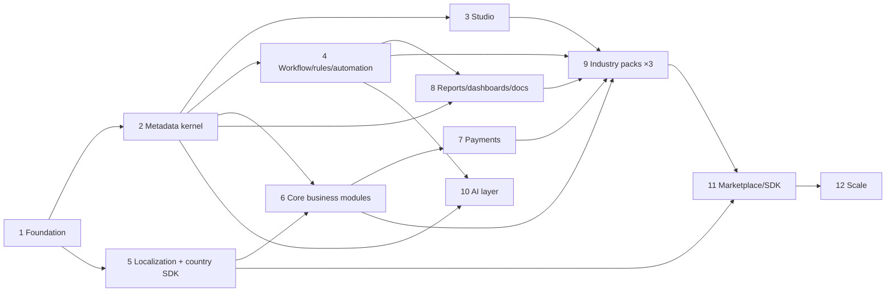

# J. Implementation Roadmap

The MVP (§108) spans Phases 1–11. Phase 12 is post-MVP scale-out. **No phase counts as done
until lint, type checks, unit, integration, tenant-isolation tests and the build all pass in CI**
(§111). Each phase ends with a completion report and doc updates.

Dependency order:

Phases 4, 5 and 8 can run in parallel with a second team once Phase 2 is merged.

---

## Phase 1 — Platform foundation

**Goals.** A running skeleton that already enforces the non-negotiables: tenant isolation, identity,
organization, authorization, audit, correlation, error model, module boundaries, developer
environment and CI.

**Out of scope (scope discipline):** complete accounting, hospital, education or restaurant
workflows, POS, AI generation, marketplace, metadata entities, mobile. Anything not listed below
waits for its phase.

| | |
|---|---|
| **Database** | `platform` (outbox, inbox, idempotency_record, scheduled_job), `tenancy` (tenant, tenant_settings, residency_policy, entitlement_snapshot), `organization` (org_unit_type, org_unit, org_unit_closure, legal_entity_profile), `identity` (user, tenant_membership, api_key, service_account), `authorization` (permission, permission_set, role, role_assignment with scope, policy, field_permission, sod_rule), `audit` (audit_event monthly-partitioned, audit_anchor). Control-plane DB: tenant registry, region, cell. DB roles `erp_owner`, `erp_app`, `erp_dispatcher`; every table classified by scope; RLS forced on every tenant table. |
| **Backend** | Gradle multi-project with toolchain 21 and convention plugins; `platform-core/-persistence/-security/-web/-events/-test`; modules `tenancy`, `organization`, `identity`, `authorization` (RBAC + scopes; ABAC hook with CEL deferred to Phase 2), `audit` (write + sealer + verify), `features`; `erp-app` (web + worker profiles) and `control-plane-app` (tenant provisioning into the local cell); OTel, JSON logs, RFC 9457 problem details, correlation id, idempotency filter; Spring Modulith + ArchUnit rules (module matrix, no `internal` access, no cloud SDKs outside adapters, no country literals in kernel). |
| **APIs** | CP: `POST/GET /api/v1/tenants`. Cell: `/api/v1/me`, `/api/v1/org-units`, `/api/v1/legal-entities`, `/api/v1/users`, `/api/v1/roles`, `/api/v1/role-assignments`, `/api/v1/audit-events`, `/api/v1/audit/verify`. OpenAPI generated and committed to `contracts/`. |
| **Frontend** | pnpm workspace: `apps/web`; `packages/ui` (tokens, Radix primitives, logical CSS), `packages/i18n` (FormatJS, `en` + one RTL smoke locale), `packages/auth` (OIDC PKCE), `packages/api-client` (generated), `packages/shared`, `packages/config`; app shell with login, tenant indicator, org tree admin, user & role admin, audit viewer. |
| **Dependencies** | `infra/local/compose.yaml`: Postgres 16, Redis, Keycloak (realm `erp` imported), MinIO, Mailpit; optional OTel/Grafana profile. `scripts/dev-up`, `scripts/dev-check`; `docs/dev/getting-started.md`. GitHub Actions: backend build+test, frontend lint/typecheck/test/build, gitleaks, Semgrep, Trivy (fs). |
| **Tests** | Unit (domain), Testcontainers integration **as `erp_app`**, **TenantIsolationSuite v1** (API, malformed requests, repository, direct SQL, background execution, catalog), authz matrix tests, audit chain verification tests, ArchUnit/Modulith, migration-from-empty test, frontend Vitest + Playwright smoke (login, org tree) + axe smoke. |

**Acceptance criteria.** Phase 1 is complete only when all of these hold:

1. **Tenant isolation:** Tenant A and Tenant B are provisioned through the control-plane API. A cannot
   access B's data through the API, the repository layer, a direct DB connection with the
   application credentials, or background execution (job, outbox handler), all proven by automated tests.
2. **Authentication:** OIDC login (authorization code + PKCE via Keycloak) works end to end in the web
   app and against the API.
3. **Authorization:** unauthorized requests get the correct denial: 401 unauthenticated, 403 lacking
   permission, 404 for another tenant's or an out-of-scope resource. Covered by authz matrix tests.
4. **Organization:** a tenant can create legal entities, branches and departments in its org tree.
5. **Audit:** sensitive changes (org, users, roles, assignments) create audit events in the same
   transaction, the chain is sealed, and `/api/v1/audit/verify` validates it; tampering is detected in a test.
6. **Database:** all migrations run from an empty database; the RLS catalog test passes.
7. **Local environment:** a new engineer brings up dependencies with the documented commands
   (Docker Compose) and runs the app from `docs/dev/getting-started.md`.
8. **Backend build passes; frontend build passes; all tests pass.**
9. **CI is green from a clean checkout** on GitHub Actions.

## Phase 2 — Metadata ERP kernel

**Goals.** Define entities/fields/relationships as manifests, publish revisions, and CRUD
records through a generic, permission-aware, fast API.

| | |
|---|---|
| **Database** | `metadata` (entity_def, field_def, relationship_def, form_def, view_def, config_package, config_revision, changeset), `records` (record hash-partitioned, record_link, record_translation, record_ref), `documents.number_sequence`. |
| **Backend** | Manifest JSON Schemas (`sdk/schemas`); validator; compiler → runtime model cache; CEL integration (formula, validation, default, conditional visibility/requirement); record service (validation, slots, sequences, formulas, rollups-lite); query AST → SQL compiler with row/field security; system-entity bridge so hardened entities accept custom fields. |
| **APIs** | `/api/v1/metadata/{entities,changesets,revisions}`, `/api/v1/records/{entity}` CRUD + query (`filter`, `sort`, cursor), `/api/v1/metadata/validate`, `/api/v1/metadata/impact`. |
| **Frontend** | `packages/metadata-renderer`: generic list view, record form (sections/tabs/columns), related lists, field widgets for all MVP field types; `packages/cel` (client-side evaluation for visibility only; server authoritative). |
| **Tests** | Property tests for CEL sandbox limits; compiler golden tests; query security tests (field masking, scope predicates); perf baseline (1M records/tenant partition); isolation suite extended to records. |
| **Acceptance** | A YAML manifest defining `Vehicle` with 15 field types incl. formula, lookup, unique sequence is pushed via API, published, and fully usable in UI with filters/sorts on indexed fields; removing a field used in a formula is blocked by impact analysis. |

## Phase 3 — ERP Studio

**Goals.** Non-technical admins produce the same manifests through UI.

| | |
|---|---|
| **Database** | none new (uses changesets/revisions); `metadata.page_def`. |
| **Backend** | Changeset editing API, diff service, approval policy on publish, rollback. |
| **APIs** | `/api/v1/studio/changesets/{id}/{diff,submit,approve,publish}`, `/api/v1/metadata/revisions/{id}/rollback`. |
| **Frontend** | Studio: entity & field builder, relationship builder, drag-drop form builder (dnd-kit), view builder (list/kanban/calendar), page builder (MVP components), permissions editor, revision history with diff, YAML view toggle. |
| **Tests** | Round-trip test: UI edit → manifest → re-open identical; E2E Playwright build-an-app flow; a11y (keyboard-only form builder path). |
| **Acceptance** | An admin with no YAML knowledge builds a "Membership" app (entity, form, list, kanban, role) in Studio; exporting it produces manifests identical to the hand-written equivalent. |

## Phase 4 — Workflow platform

**Goals.** Durable workflows, approvals, rules and automations.

| | |
|---|---|
| **Database** | `workflow` (workflow_def, instance, step_execution, human_task, timer, approval_policy, approval_request, delegation), `automation` (automation_def, run, run_step), `rules` (rule_set, rule), job scheduler tables. |
| **Backend** | `WorkflowRuntime` port + DB-backed engine (state machine + graph: sequential, parallel, conditional, timers, SLA, webhook/callback wait, human task, automated task, AI task hook); approval engine (single/sequential/parallel/majority/unanimous, amount/role/department/manager-hierarchy routing, delegation, substitutes, escalation, expiry, maker≠checker); automation triggers (record events, status change, schedule, webhook, threshold, date reached) and actions (create/update record, email, webhook, start workflow, request approval, generate document, publish event). |
| **APIs** | `/api/v1/workflows/{defs,instances}`, `/api/v1/tasks` (inbox, claim, complete, reassign), `/api/v1/approvals`, `/api/v1/automations` (+ run history, replay). |
| **Frontend** | Visual workflow designer (React Flow), approval policy editor, rule builder (IF/THEN UI ↔ CEL), automation builder, task inbox, approval UI with history. |
| **Tests** | Deterministic engine tests with virtual clock; crash-recovery tests (kill worker mid-step, resume exactly once); approval matrix tests; SoD tests. |
| **Acceptance** | "Orders > 500,000 need Finance; > 2,000,000 also CEO" configured without code, survives worker restarts, escalates after SLA, audit shows every step. |

## Phase 5 — Localization & Country Pack SDK

| | |
|---|---|
| **Database** | `localization` (locale, language_pack, translation_key, translation with status/version, translation_memory), currency & fx_rate (in `finance`), `tax` schema (jurisdiction, registration, tax_type, tax_code, tax_category, tax_rate effective-dated), identifier types, address formats, holiday calendars, `packs` (installed_pack, installation, overlay). |
| **Backend** | Locale cascade resolver; ICU message rendering server-side; Language Pack Studio APIs; Country Pack SPI (`IdentifierValidator`, `TaxDeterminationStrategy`, `DocumentValidator`, `EInvoiceAdapter`, `PayrollRuleSet`, `StatutoryReportProvider`); pack installer v1 (local artifacts); packs **IN, AE, US** v0 (data + strategies), stubs for others; FX rate source adapters (ECB + manual). |
| **APIs** | `/api/v1/i18n/{bundles,translations,missing}`, `/api/v1/packs`, `/api/v1/tax/{codes,rates,determine}`, `/api/v1/fx-rates`. |
| **Frontend** | Language/locale/timezone/calendar preferences; RTL full pass; Language Pack Studio (import/export XLIFF, review queue); tax configuration screens. |
| **Tests** | Localization matrix (see localization.md §9); visual regression `ar`/`he`; tax golden tests per pack (intra-state vs inter-state GST, UAE VAT standard/zero/exempt, US multi-jurisdiction); effective-dating tests (rate change mid-month; historical recompute unchanged). |
| **Acceptance** | Same kernel serves an `ar-AE` RTL user with Hijri display and a `te-IN` user; GST split CGST/SGST vs IGST computed by IN pack, VAT by AE pack, with zero `if country` in kernel (enforced by rule). |

## Phase 6 — Core business modules (foundation)

| | |
|---|---|
| **Database** | `finance` (account, coa, fiscal_year, period, journal, journal_entry, journal_line, account_period_balance, bank_account, exchange_rate), `billing` (invoice, invoice_line, tax_line, credit_note, receipt_allocation), `inventory` (item, uom, uom_conversion, warehouse, location, lot, serial, stock_move, stock_quant, reservation, valuation_layer), `crm`, `sales` (quotation, sales_order, price_list), `procurement` (requisition, purchase_order, goods_receipt, bill match). |
| **Backend** | Immutable ledger + `PostingService` + reversal; periods & close; AR/AP basics (invoices, bills, allocation, ageing); inventory movement ledger, valuation (FIFO, moving average), reservations; CRM pipeline; quote→order→invoice; requisition→PO→GRN→bill with 2/3-way match. All expose system entities for Studio customization. |
| **APIs** | `/api/v1/finance/{accounts,journal-entries,periods,reports/trial-balance}`, `/api/v1/billing/invoices` (+ `/post`, `/credit-notes`), `/api/v1/inventory/{items,moves,stock}`, `/api/v1/crm/*`, `/api/v1/sales/*`, `/api/v1/procurement/*`. |
| **Frontend** | CoA, journal entry, trial balance, invoice, bill, item, stock, order screens using the metadata renderer + custom hardened components where needed. |
| **Tests** | Financial tests: double-entry, rounding across 0/2/3-decimal currencies, FX realized/unrealized, reversal, closed-period rejection, idempotent posting under concurrent retries; inventory concurrency (no oversell), valuation golden tests. |
| **Acceptance** | Invoice in USD for an INR legal entity posts balanced journal with correct functional amounts; posted entries cannot be updated (DB rejects); trial balance ties; custom field added in Studio appears on invoice without code. |

## Phase 7 — Payments

| | |
|---|---|
| **Database** | `payments` (provider_account, payment_intent, attempt, refund, dispute, mandate, payout, settlement, settlement_line, webhook_inbox, routing_rule). |
| **Backend** | `PaymentProvider` SPI; canonical state machine; router; webhook ingestion with dedupe; settlement import & reconciliation → finance postings; adapters: **Stripe** and **Razorpay** first (covers card/ACH/wallets and UPI/NetBanking), plus `ManualPaymentProvider` (cash/cheque/bank transfer). |
| **APIs** | `/api/v1/payments/{intents,refunds,links}`, `/webhooks/payments/{provider}/{account}`. |
| **Frontend** | Provider account setup, pay-invoice flow (hosted fields / redirect), payment links, reconciliation workbench. |
| **Tests** | Adapter contract tests; duplicate & out-of-order webhooks; partial capture/refund; crash between provider success and DB commit (reconciled by webhook/poll); no PAN in logs (log scanner test). |
| **Acceptance** | Same invoice paid via Stripe (USD card) and Razorpay (INR UPI) with no finance/billing code change; replayed webhooks never double-apply. |

## Phase 8 — Reports, dashboards, documents, notifications, files

| | |
|---|---|
| **Database** | `reporting` (report_def, dashboard_def, schedule), `documents` (template, template_version, rendered_document), `communications` (template, message, delivery), `notifications`, `files` (file_object, version, attachment). |
| **Backend** | Report query engine over the query AST (grouping, aggregation, pivot, drill-down) on read replicas; async export (CSV/XLSX/PDF) respecting classification; dashboard widgets; document engine (sandboxed HTML templates → PDF with RTL/fonts, QR/barcode, localized, versioned); email channel adapter (`EmailProvider`: SMTP first) with templates; notification center; `StorageProvider` (S3-compatible, MinIO first) with signed URLs and AV-scan hook. |
| **Frontend** | Report builder, dashboard builder, template editor with preview per locale, notification center, attachments panel, activity timeline. |
| **Tests** | Report security (row/field security in aggregates — no leakage via counts), PDF golden files (Arabic, Telugu), large export job tests. |
| **Acceptance** | A CFO dashboard and a scheduled ageing report emailed as PDF in Arabic, containing only permitted legal entities. |

## Phase 9 — Industry packs: Education, Healthcare, Restaurant

| | |
|---|---|
| **Database** | **None in the kernel.** `scheduling` module (resource, availability, booking, recurrence) and `pos`-lite are generic kernel capabilities built here if not already present. |
| **Backend** | Pack content only (manifests, templates, roles, dashboards, sample demo data), plus generic capabilities discovered to be missing — each must be justified as industry-neutral. |
| **APIs** | none pack-specific; packs use records/workflow/scheduling/billing APIs. |
| **Frontend** | none pack-specific beyond manifest-defined pages; any new widget goes to the generic component library. |
| **Tests** | Pack validation (no country codes, no kernel references outside public contracts); E2E per pack; **composition matrix**: Education×IN×(en,te)×Razorpay, Healthcare×AE×(ar,en)×Adyen-stub, Restaurant×US×(en,es)×Stripe — on one deployment. |
| **Acceptance** | §113 definition of success demonstrated on one build; `git diff` of the kernel between "no packs" and "3 packs installed" is empty. |

## Phase 10 — AI layer

| | |
|---|---|
| **Database** | `ai` (provider_config, agent_def, interaction, tool_call, action_proposal, embedding with pgvector). |
| **Backend** | `AiPlatform` + `AiProvider` adapters (OpenAI default, Anthropic; others later; self-hosted deferred); router honoring residency/"external AI disabled"; tool registry generated from module APIs; policy engine with action tiers 0–4; proposal→approval→execute; Ask-ERP; AI Builder producing changesets; Process Builder; document extraction pipeline (invoices/receipts). |
| **APIs** | `/api/v1/ai/{chat,proposals,agents,builder/sessions,extract}`. |
| **Frontend** | Copilot panel with citations and fact/analysis separation; Builder wizard with manifest preview & diff; Agent Studio; proposal approval UI. |
| **Tests** | Eval suite (no fabrication, permission leakage, prompt injection via record text, multilingual, tier 3/4 handling); cost/latency budgets; audit completeness. |
| **Acceptance** | Hospital description → reviewed changeset → published app in a sandbox; "post this journal" from chat produces a proposal that only a permitted, non-maker user can approve. |

## Phase 11 — Marketplace & Extension SDK

| | |
|---|---|
| **Database** | CP `marketplace` (publisher, package, package_version, signature, compatibility); cell `packs` upgrade/rollback history. |
| **Backend** | Registry, signing & verification, dependency resolution, install/upgrade/rollback with overlay merge, remote extension contract (event delivery + scoped tokens), `erpctl` CLI, SCIM. |
| **APIs** | `/api/v1/marketplace/*` (CP), `/api/v1/packs/{install,upgrade,rollback}`, extension registration. |
| **Frontend** | Marketplace catalog, install consent screen, upgrade conflict resolver. |
| **Tests** | Tampered package rejected; incompatible version blocked; upgrade with tenant overlays; rollback restores prior revision. |
| **Acceptance** | A third-party "Gym" pack + remote extension installs on a tenant without platform deployment, and can be rolled back. |

## Phase 12 — Scale & reliability (post-MVP)

Kafka outbox relay; Temporal adapter for `WorkflowRuntime`; OpenSearch global search with
permission filtering; ClickHouse analytics + process mining; multi-region cells + DR drills;
dedicated-table storage mode for hot metadata entities; load tests (k6) with published budgets;
chaos tests; offline-first POS/mobile sync (encrypted local store, sync queue, idempotent ops,
conflict resolution).

---

## Product decisions (locked 2026-09-24)

| # | Question | Decision |
|---|---|---|
| 1 | First go-to-market country | **India**, delivered only through the India Country Pack; the kernel stays country-neutral |
| 2 | Hosting | **Hostinger VPS first, region India (Mumbai)**, cloud-portable (ADR-0014); AWS is the primary later migration target |
| 3 | Default AI provider | **OpenAI**, behind `AiProvider`; no self-hosted LLM in the MVP (ADR-0017) |
| 4 | Mobile framework | **Flutter** (ADR-0013); not in Phase 1 |
| 5 | Licensing | proprietary platform and official packs; documented Pack SDK and manifest spec; licence metadata per package (ADR-0012) |
| 6 | Product name | none yet; codename `global-erp`; neutral `erp` identifiers; configurable branding (ADR-0015) |

## Open questions (not blocking Phase 1)

1. **Off-site backup location within India** (second Hostinger data center vs an India-region
   S3-compatible service). Needed before the first production tenant.
2. **Edge/WAF/CDN provider** in front of Hostinger. Needed before the first production tenant.
3. **Payment provider priority for India** beyond Razorpay (for example PayU, Cashfree). Needed before Phase 7.
4. **Which Indian languages ship first** after English (Telugu and Hindi assumed). Needed before Phase 5.
