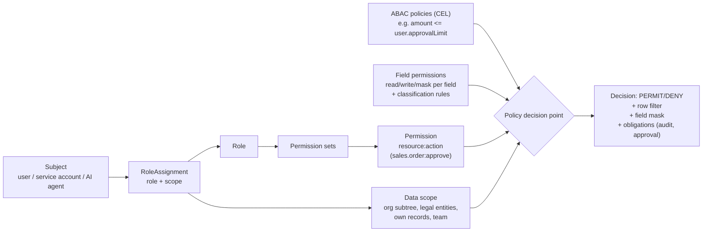

# G. Security Model

## 1. Principles

Secure by default, least privilege, server-side enforcement only (the frontend hides; the
server decides), deny by default, every sensitive action audited, tenant isolation is
critical-severity.

## 2. Authentication

- **Keycloak** (behind the `identity` module's `IdentityProvider` port — ADR-0010) provides
  password + MFA (TOTP, WebAuthn/passkeys), OIDC, SAML 2.0 brokering to customer IdPs (Entra,
  Okta, Google Workspace, Auth0), social login, and brute-force protection. One realm per cell;
  tenants are modelled with Keycloak Organizations; enterprise tenants attach their own IdP.
- The ERP never stores passwords. It stores the `User` profile, tenant membership and the
  external subject id.
- **Service accounts** (OAuth2 client credentials) and **API keys** (hashed with a prefix for
  lookup, scoped, expiring, rotatable) for machine access.
- **SCIM 2.0** endpoint (Phase 11) for enterprise user provisioning.
- Sessions: short-lived access tokens (5–10 min), refresh with rotation, device/session list
  with revoke.

## 3. Authorization model

**Authentication vs authorization.** Keycloak proves *who you are*. The ERP `authorization` module
decides *what you may do, on which data, under which legal entity and branch, and under what
conditions*. No business permission is encoded as a Keycloak role (ADR-0010).

**A grant has four parts: Action + Resource + Scope + Condition.**

| Part | Meaning | Example |
|---|---|---|
| Action + Resource | the permission string `resource:action` | `billing.invoice:read`, `edu.patient:read`, `finance.journal:post` |
| Scope | which rows: `TENANT`, `LEGAL_ENTITY[ids]`, `ORG_SUBTREE[node]`, `OWN_BRANCH` (the user's assigned branches), `OWN`, `TEAM` | `billing.invoice:read` with scope `OWN_BRANCH` |
| Condition | optional CEL predicate over subject, resource and environment | `resource.assignedDoctorId == subject.userId`; `resource.amount.value <= subject.approvalLimit` |

Roles *group* permissions (through permission sets). Policies decide contextual access. Tenants do
not need thousands of roles: a handful of roles combined with assignment-time scopes (the same
"Branch Manager" role assigned for Branch A and for Branch B) covers most organizations.

- **Permissions** are `resource:action` strings declared by modules and by metadata entities
  (every entity gets `read/create/update/delete/export` plus declared custom actions like
  `approve`, `post`, `refund`). They are data, so packs add permissions without code.
- **RBAC:** roles bundle permission sets; tenant admins create roles; packs ship role templates
  (Principal, Doctor, Cashier…).
- **Data scopes (row-level):** each role assignment carries a scope: `TENANT`, `LEGAL_ENTITY
  [ids]`, `ORG_SUBTREE [node]`, `OWN_BRANCH`, `OWN`, `TEAM`, or a CEL predicate. Scopes compile to
  SQL predicates on the ownership-scope columns and dimensions that each aggregate declares
  ([domain-model.md §5](domain-model.md#5-ownership-and-scope-model)). A scope that does not apply to
  an aggregate is rejected at assignment time. Effective access is the union of the user's
  assignments, minus explicit denies.
- **ABAC:** CEL policies over subject, resource, action and environment attributes (amount,
  status, time, IP, MFA level). Used for limits ("post journals up to 1,000,000 functional
  currency"), conditional actions and step-up MFA.
- **Field-level security:** per field read/write/mask by role, plus classification-driven
  defaults (e.g. `Health` fields hidden unless the role has `data.health:read`). Masking is
  applied in the API serialization layer, exports, search results and AI tool outputs.
- **Inheritance and overrides:** permission sets compose; explicit DENY overrides PERMIT; scope
  inheritance follows the org tree.
- **Enforcement points:** method-level (`@Authorize("sales.order:approve")`) in module APIs,
  query-level row filters in repositories/query compiler, serializer-level field masks. The PDP is
  an in-process library with a cached compiled policy per (tenant, user, revision); it can be
  replaced with an external engine (OPA/Cedar) behind the same interface if needed.

## 4. Segregation of duties

- **SoD rules** are pairs/sets of incompatible permissions (`supplier:create` × `supplier:approve`,
  `payment:create` × `payment:approve`), shipped by packs and editable by tenants.
- Checked at **role assignment** (block or require approval with justification) and at
  **action time** (maker ≠ checker on the same record, enforced by the approval engine using the
  record's audit trail).
- SoD report and violation alerts; exceptions are time-boxed and audited.

## 5. Audit

Full design: [ADR-0016](adr/0016-tamper-evident-audit.md). In summary:
- Every security or business mutation writes an `audit_event` **in the same transaction** as the
  change. It records the actor (user, service account or agent, plus on-behalf-of), tenant, legal
  entity, action, object, masked before/after diff, request metadata, correlation and causation ids,
  and reason.
- A sealing job hash-chains events per tenant chain partition (SHA-256 over JCS-canonical JSON).
  Chain heads are anchored hourly to WORM object storage and signed.
- Verification is available through an API and a scheduled job.
- Monthly partitions are archived with their verification material.
- Audit is not application logging, and application code never deletes it.

## 6. Data classification

Classifications: `PUBLIC, INTERNAL, CONFIDENTIAL, PII, FINANCIAL, HEALTH, RESTRICTED` on
entities and fields (metadata). A **policy table** maps classification → controls: export
allowed?, masking default, field encryption required, log redaction, AI processing allowed
(internal model only / none / any), API exposure, retention. Downgrading a classification is a
high-risk config change requiring approval (impact analysis flags it).

## 7. Encryption and secrets

- TLS 1.2+ everywhere (1.3 preferred), HSTS; internal mTLS in production clusters.
- Storage-level encryption at rest: encrypted VPS volumes (LUKS) or provider disk encryption,
  Postgres backups encrypted, bucket encryption.
- **Key management behind a `KeyManagement` port** (ADR-0014). The first implementation is the
  OpenBao transit engine per region; AWS KMS, GCP KMS or Azure Key Vault are later adapters.
- **Field-level encryption** for `encrypted` fields and RESTRICTED data: envelope encryption with
  per-tenant data keys wrapped by the regional key; key rotation by re-wrap; crypto-shredding on
  tenant deletion. Encrypted fields are not searchable except through an optional blind index.
- Secrets (DB credentials, provider API keys, webhook secrets, tenant connector credentials) are
  resolved through a `SecretsProvider` port (OpenBao KV first) and never appear in source, logs or
  events. Gitleaks runs in CI.
- Customer-managed keys (BYOK) designed for via the key-reference indirection; built later.

## 8. Data residency enforcement

Tenant residency policy (primary region, backup region, AI-processing region, log region, export
restrictions, external-AI disabled) is part of tenant config in the cell. Enforced at:
- provisioning (cell selection), backups (bucket region), log shipping (collector routing),
- AI provider selection (router refuses providers outside allowed regions or external providers
  when disabled),
- exports and integrations (connector destinations declare region; policy check before send).

## 9. Application security baseline

- OWASP ASVS L2 as the target checklist; security tests in CI (SAST: Semgrep/CodeQL; SCA:
  Dependabot + OSV; container scan: Trivy; DAST against staging: ZAP baseline).
- Input validation at API boundary (Bean Validation + JSON Schema for manifests), output encoding in
  templates, CSP on the SPA, no inline scripts; document templates rendered in a sandbox with no
  network/file access.
- Rate limiting and abuse controls per tenant/user/API client; account lockout via IdP.
- File uploads: size/type allow-list, content sniffing, antivirus scan hook before availability,
  served only via signed URLs from a separate domain.
- Webhooks inbound: signature verification + timestamp window + dedupe; outbound: HMAC signed.
- Formula/rule/template sandboxes: CEL (no I/O, bounded cost), template engine without
  reflection/method calls.

## 10. Compliance posture

India's **Digital Personal Data Protection Act, 2023** (consent, purpose limitation, data-principal
rights, breach notification) is the first privacy regime to evidence, given the India-first launch.
The architecture is designed so controls for GDPR, SOC 2, ISO 27001, PCI DSS (SAQ-A scope by
never handling PAN), HIPAA-style healthcare deployments and regional privacy laws can be
implemented and evidenced. **No certification is claimed.** Privacy features: retention policies,
archival, legal hold, deletion/anonymization workflows, subject access and portability exports,
consent records (the `compliance` module).
